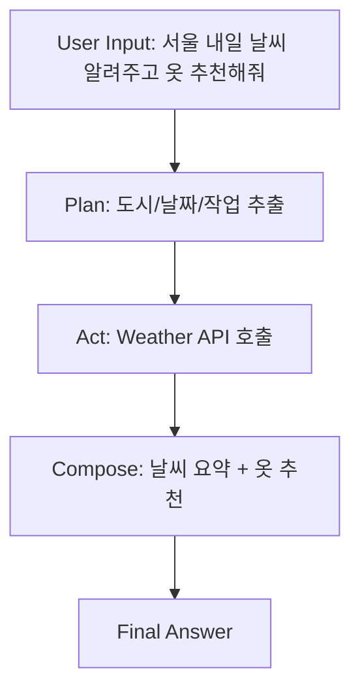

# Fixed Flow

발표용 흐름도입니다.

```mermaid
flowchart TD
    A["User Input: 서울 내일 날씨 알려주고 옷 추천해줘"] --> B["Plan: 도시/날짜/작업 추출"]
    B --> C["Act: Weather API 호출"]
    C --> D["Compose: 날씨 요약 + 옷 추천"]
    D --> E["Final Answer"]
```

핵심 메시지:

> Agent는 단순히 답변을 생성하는 것이 아니라, 정해진 흐름에 따라 도구를 호출하고 작업을 수행한다.
